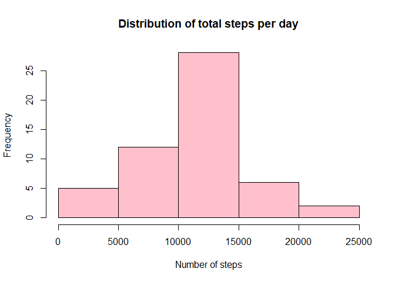
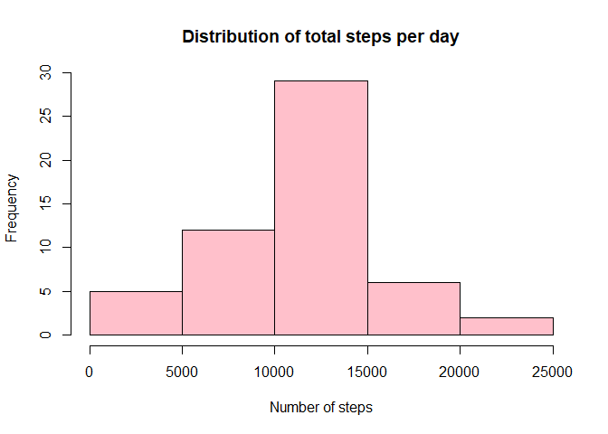

Reproducible Research - Course Project 1
=========================================

##Loading and preprocessing the data

Process/transform the data (if necessary) into a format suitable for your analysis. Below will load the data assuming that the working directory is correct. Transforms date into correct format.


```r
activity <- read.csv("activity.csv")
activity$date <-as.Date(activity$date)
```


##What is mean total number of steps taken per day?
###For this part of the assignment, you can ignore the missing values in the dataset.

1. Calculate the total number of steps taken per day.

```r
daysteps <- aggregate(steps ~ date, activity, sum, na.rm=TRUE)
```


2. If you do not understand the difference between a histogram and a barplot, research the difference between them. Make a histogram of the total number of steps taken each day. 

```r
hist(daysteps$steps, col="pink", main="Distribution of total steps per day", xlab="Number of steps")
```

<!-- -->

3. Calculate and report the mean and median of the total number of steps taken per day.


```r
meana <- mean(daysteps$steps)
median <- median(daysteps$steps)
```
The mean number of steps per day is 1.0766189\times 10^{4}. The median number of steps per day is 10765.


##What is the average daily activity pattern?

1. Make a time series plot (i.e. type = "l") of the 5-minute interval (x-axis) and the average number of steps taken, averaged across all days (y-axis)

```r
avg_steps<- with(activity,tapply(steps,interval,mean,na.rm=TRUE))
intervals<-unique(activity$interval)
intervalavg <-data.frame(cbind(avg_steps,intervals))
plot(intervalavg$intervals,intervalavg$avg_steps,type = "l",xlab = "Intervals",
     ylab = "Average Steps",main = "Average Steps per Interval")
```

<!-- -->


2. Which 5-minute interval, on average across all the days in the dataset, contains the maximum number of steps?


```r
intervalmax <- intervalavg[which.max(intervalavg$steps),]$interval
```
On average, the maximum number of steps are taken in the interval . 


##Imputing missing values
Note that there are a number of days/intervals where there are missing values. The presence of missing days may introduce bias into some calculations or summaries of the data.

1. Calculate and report the total number of missing values in the dataset (i.e. the total number of rows with NAs)

```r
missing <- sum(is.na(activity$steps))
```
The total number of missing values is 2304. 


2. Devise a strategy for filling in all of the missing values in the dataset. The strategy does not need to be sophisticated. For example, you could use the mean/median for that day, or the mean for that 5-minute interval, etc.

To fill in the missing values, I shall use the mean values for each interval. This is already stored in 'intervalavg'.


```r
head(intervalavg)
```

```
##    avg_steps intervals
## 0  1.7169811         0
## 5  0.3396226         5
## 10 0.1320755        10
## 15 0.1509434        15
## 20 0.0754717        20
## 25 2.0943396        25
```


3. Create a new dataset that is equal to the original dataset but with the missing data filled in.


```r
activity2 <- activity
for(i in 1:nrow(activity2)) {
if(is.na(activity2[i,]$steps)) {
    activity2[i,]$steps <- intervalavg[i,1]
}
}
```

4. Make a histogram of the total number of steps taken each day and Calculate and report the mean and median total number of steps taken per day. Do these values differ from the estimates from the first part of the assignment? What is the impact of imputing missing data on the estimates of the total daily number of steps?

```r
daysteps2 <- aggregate(steps ~ date, activity2, sum, na.rm=TRUE)
hist(daysteps2$steps, col="pink", main="Distribution of total steps per day", xlab="Number of steps")
```

<!-- -->

```r
mean2 <- mean(daysteps2$steps)
median2 <- median(daysteps2$steps)
```

The mean number of steps per day is 1.0766189\times 10^{4}. The median number of steps per day is 1.0765594\times 10^{4}.

The values do differ from the first part of the assignment, as NAs have now been replaced with positive values. 


##Are there differences in activity patterns between weekdays and weekends?
For this part the weekdays() function may be of some help here. Use the dataset with the filled-in missing values for this part.

1. Create a new factor variable in the dataset with two levels - "weekday" and "weekend" indicating whether a given date is a weekday or weekend day.


```r
activity2$day <- weekdays(activity2$date)
```


```r
for (i in 1:nrow(activity2)) {

if(activity2[i,]$day =="Saturday" | activity2[i,]$day=="Sunday") {
   activity2[i,]$day <- "Weekend"
}   else {activity2[i,]$day <- "Weekday"}

}

##activity2$Weekend <- as.factor(activity2$Weekend)
```

2. Make a panel plot containing a time series plot of the 5-minute interval (x-axis) and the average number of steps taken, averaged across all weekday days or weekend days (y-axis). See the README file in the GitHub repository to see an example of what this plot should look like using simulated data.


```r
library(lattice)
wkmean <- aggregate(steps~day+interval, activity2, mean)
```


```r
xyplot(steps~interval | day, wkmean, type = "l", layout = c(1,2))
```

<!-- -->
